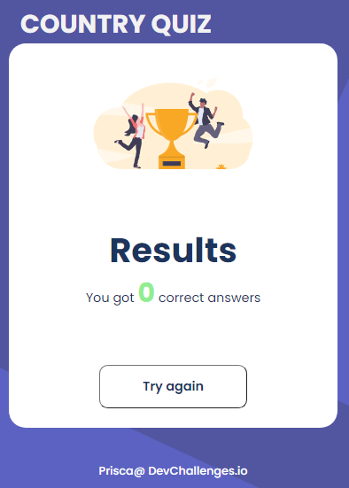
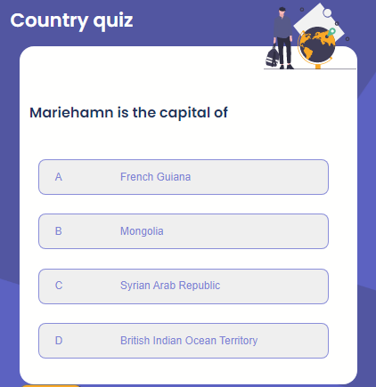

# Country Quiz

[Demo](https://prisca-country-quiz.netlify.app/)
[solution](https://github.com/ravinalamada/country-quiz)

## Overview




### Where can I see your demo?
You can find my demo in Github.com by following the github link that I wrote above.

### What was your experience?
I had a great deal of difficulty in debugging my code which taught me that it is good to have a nice variable name.

### What have you learned/improved?
I learned more how to display data randomly and components as well which was really new for me. I also understand more how custom hook works which makes me feel strong and happy a bit more. I still need to improve my knowledge on how react really works because I struggled a lot to solve this project. I also couldn't finish all so I need to finish so that it will works properly.

-   Your wisdom? :)
I think it is really important to have clean and well named code.

### Built With

-   [React](https://reactjs.org/)

### Features
- I have a Header components which contains the header contenets
- I have Display components that dispaly the quizes card
- A useQuiz component that contains the all logics
- Buttons components that display the button that shows the next page
- A Results component that display the result card
- Fotter component that displays the footer contents

### How To Use

<!-- Example: -->

To clone and run this application, you'll need [Git](https://git-scm.com) and [Node.js](https://nodejs.org/en/download/) (which comes with [npm](http://npmjs.com)) installed on your computer. From your command line:

```bash
# Clone this repository
$ git clone https://github.com/your-user-name/your-project-name

# Install dependencies
$ npm install

# Run the app
$ npm start
```

## Contact

-   Website [netlify.com](https://prisca-country-quiz.netlify.app/)
-   GitHub [@ravinalamada](https://github.com/ravinalamada/country-quiz)
