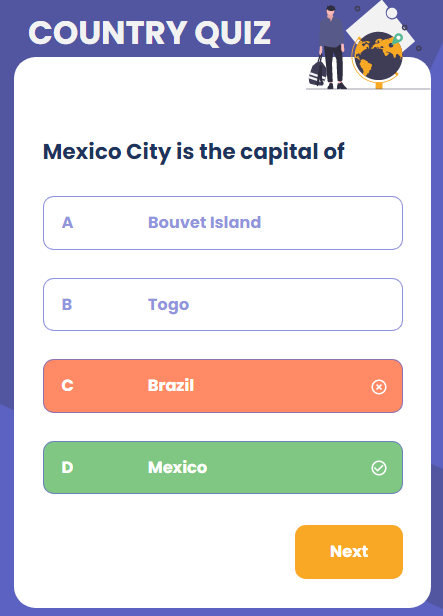

# Country Quiz

[Demo](https://prisca-country-quiz.netlify.app/)
[solution](https://github.com/ravinalamada/country-quiz)
## Overview

### Technology
- Html
- CSS
- [React](https://reactjs.org/)
- [Figma](https://www.figma.com/file/Gw0ZNBbYN8asqFlZWy3jG1)

### Features
- I have a DisplayQuiz components in where users can opt for their answers
- A useQuiz component that contains the all logics
- Buttons components that display the button which links to the next page
- A Results component that display the result card and a button which links to the home page

### How To Use
# Clone this repository
$ git clone https://github.com/your-user-name/your-project-name
# Install dependencies
$ npm install
# Run the app
$ npm start
## Contact
-   GitHub [@ravinalamada](https://github.com/ravinalamada)
